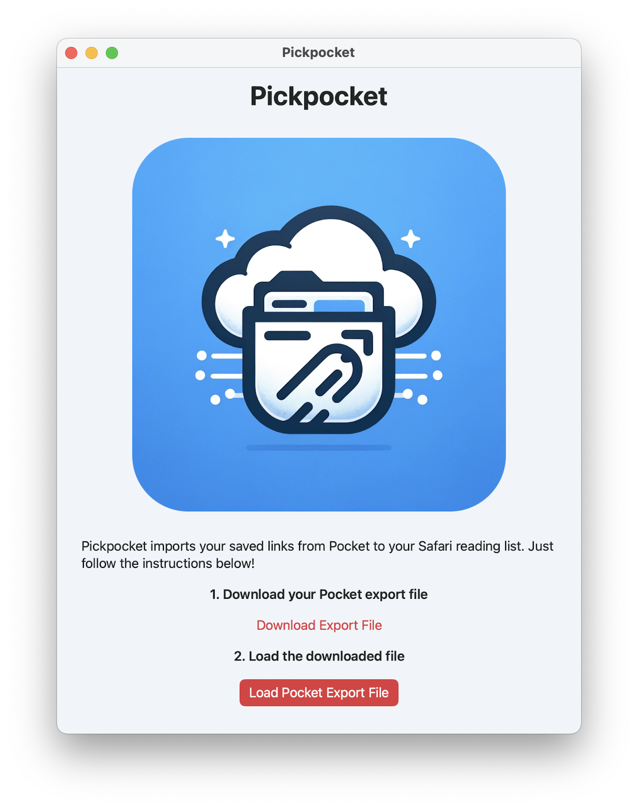
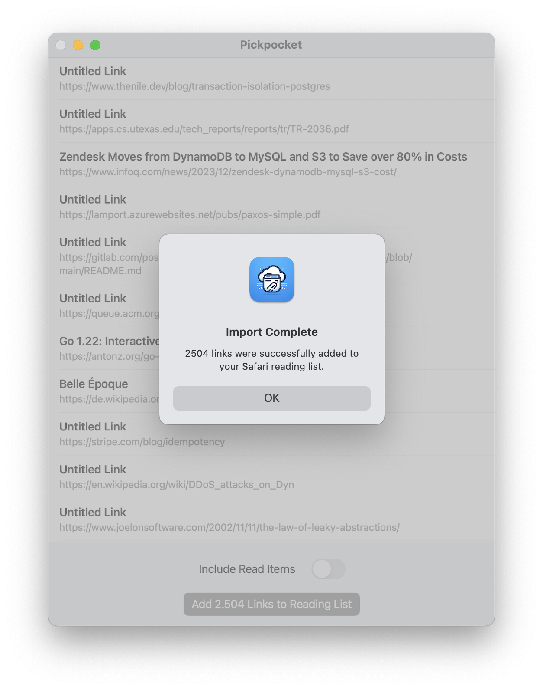

# Pickpocket

Pickpocket is a macOS application that imports links from Pocket to Safari's reading list.
It allows you to seamlessly migrate your entire reading list from Pocket to Safari.

## Screenshots

## Features

- Efficiently import thousands of links to Safari's reading list.
- Retain the original order of imported links.
- Optionally add links from Pocket's read archive (Note: they will appear as unread in Safari).
- iOS compatible (Note: On iOS, you have to confirm each link individually)

#### Instructions

1. **Export links from Pocket:**
    - Visit [getpocket.com/export](https://getpocket.com/export).
    - Download the export file containing your links.

2. **Get Pickpocket:**
    - Clone this repository.
    - Open and run the project in Xcode.

3. **Load downloaded file:**
    - Select the downloaded file in Pickpocket.
    - Optionally enable "Include Read Items".
    - Click "Add Links to Reading List".
